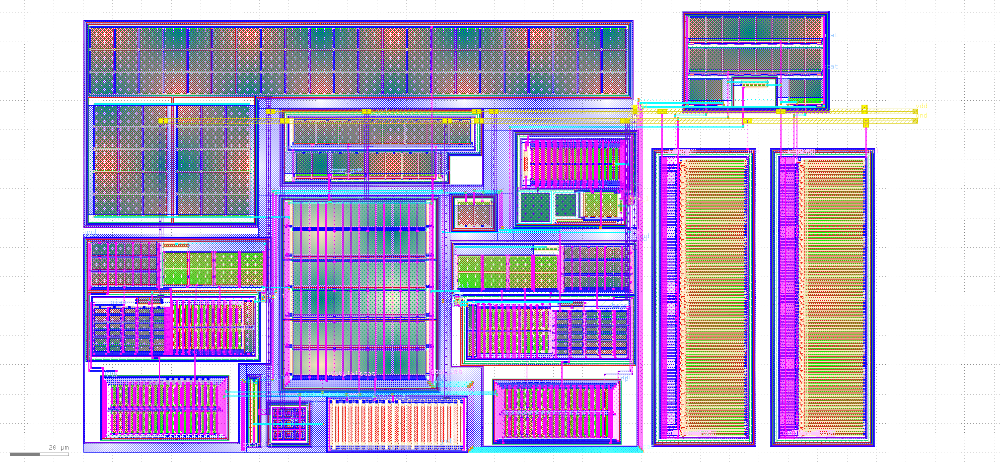

# Amatuer Radio Satellite Transceiver (SKY130) - Caravel Submission

This is the Google/EFabless/Skywater Caravel submission of the Amateur Radio Satellite Transceiver.

## Design

These blocks serve as the first pieces in a larger design of an open source amateur radio satellite transceiver -  this is the first tapeout submission.

The design sources of the continued project can be found here: [amsat_txrx_ic](https://github.com/yrrapt/amsat_txrx_ic).

### 1.3 - 3.6 GHz Fractional-N Phase Locked Loop


A S-Band phase locked loop employing a differential ring oscillator VCO with quadrature outputs. CML (Current Mode Logic) and flip-flop based pre-scaler dividers are used with a fractional-N divider which uses a 3rd order MASH structure with dithering. Finally a PFD (Phase Frequency Detector) is combined with a charge pump with off chip filtering to complete the loop.

A cell based buffer is used to drive the external 100 ohm differential output.

### Bandgap



A bandgap reference with separate PTAT and CTAT currents. Provides less than variation from -40 to 125 degrees celcius.  6 bits of trimming on both PTAT and CTAT allows less than 1% accuracy over process variations.


## Using the sources

To install the environment used for development of this repository, follow these instructions.

1. Install the tools:

```
git clone https://github.com/yrrapt/sky130_setup.git
cd sky130_setup
./install_pdk.sh
./install_tools.sh
```

2. View schematics:
```
cd amsat_txrx_ic-caravel/xschem
xschem
```

3. View layout:
```
cd amsat_txrx_ic-caravel/gds
klayout amsat_txrx_ic-caravel.gds
```

4. Run DRC:
```
cd amsat_txrx_ic-caravel/utils
./run_drc amsat_txrx_ic-caravel
```

5. Run LVS:
```
cd amsat_txrx_ic-caravel/utils
./run_drc amsat_txrx_ic-caravel
```
